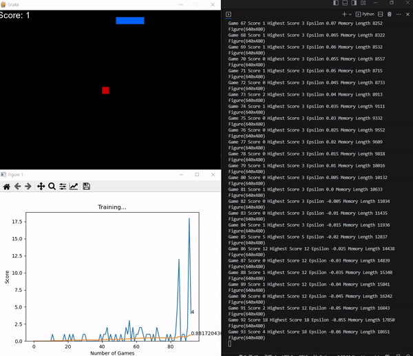
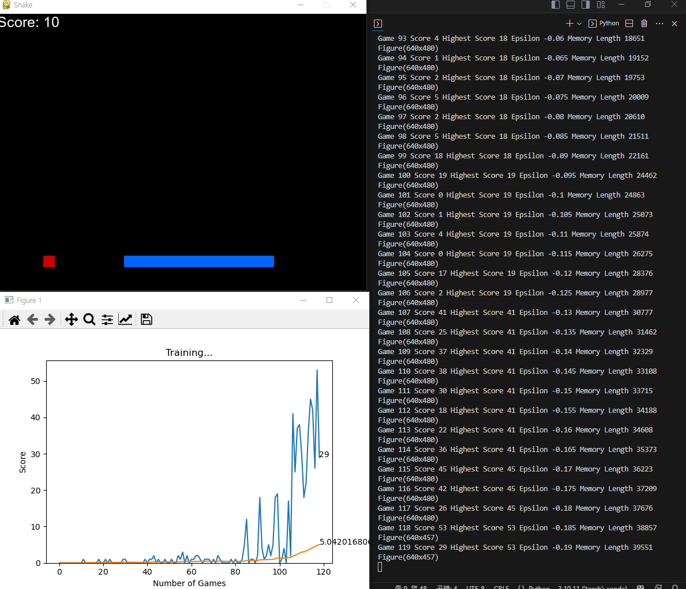
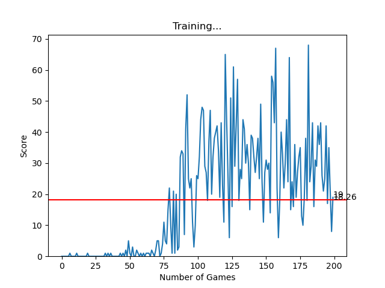

# snake-ai-freeCodeCamp.org

reward, action, state를 새롭게 설계하여 모델 학습에 성공.

## 게임 설계

### reward

- eat food: +10
- game over: -10
- else: 0

### action

- 직진: `[1, 0, 0]`
- 우회전: `[0, 1, 0]`
- 좌회전: `[0, 0, 1]`

### state

```text
[danger straight, danger right, danger left,

direction left, direction right,
direction up, direction down,

food left, food right,
food up, food down
] 
```

- 모든 value는 1 or 0
- danger: 그 방향 바로 앞에 위험한게 있는지
- direction: 현재 진행방향, 4개 중 하나만 1
- food: 8방향으로 나타냄 (e.g., 오른쪽아래 등)

## 보고서

- 80즈음을 넘어서 본격적인 학습 시작, score 10을 넘김
- 200 epoch까지 학습했을 때 최대 68까지 올라감
- 이미지 예시:





## reference

- <https://www.youtube.com/watch?v=L8ypSXwyBds>
- <https://github.com/patrickloeber/snake-ai-pytorch>
